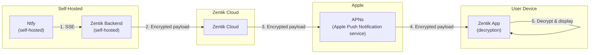

# Notification Flow: Ntfy → Zentik → APN → App

## Detailed Flow

| Step | From | To | Payload State |
|------|------|-----|---------------|
| 1 | Ntfy | Zentik Backend | SSE (Server-Sent Events) |
| 2 | Zentik Backend | Zentik Cloud | **Encrypted** |
| 3 | Zentik Cloud | APNs | **Encrypted** |
| 4 | APNs | Zentik App | **Encrypted** |
| 5 | Zentik App | — | **Decrypted** (displayed to user) |
